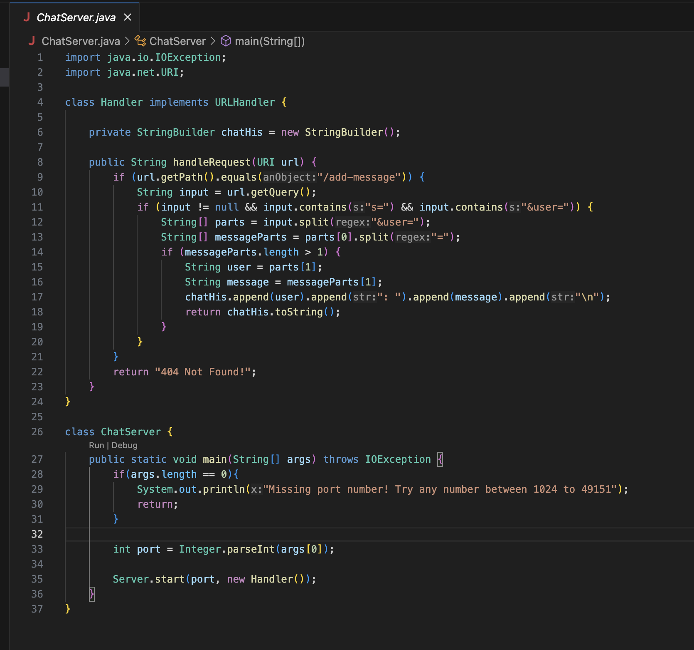
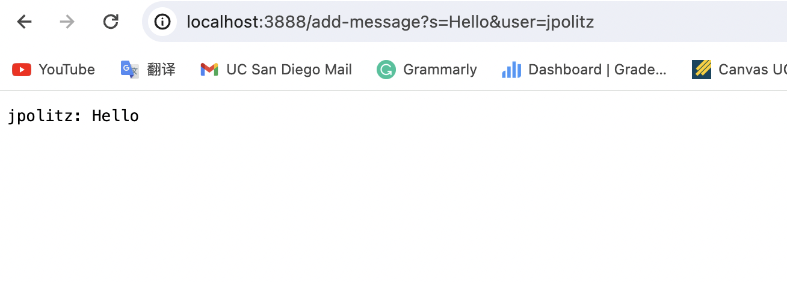
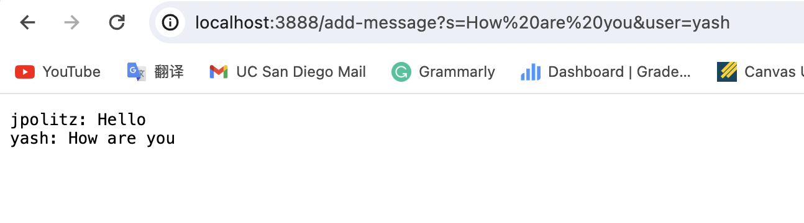
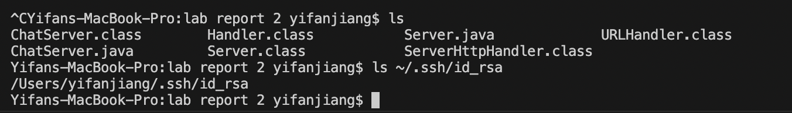
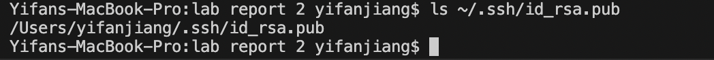
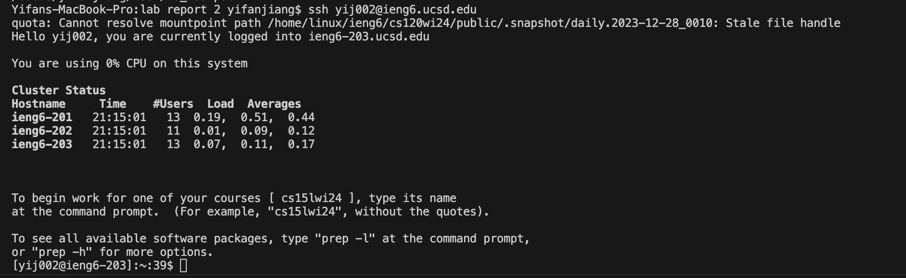

# Lab Report 2

---

---

*Part 1*

The handleRequest method and the main method are both called. 
The main method receives the argument of a port number, and it iniates the server.
For the handleRequest method, the url is the argument. In this case, the argument is http://localhost:3888/add-message?s=Hello&user=jpolitz. 
The string variable input is s=Hello&user=jpolitz. The string array parts is [s=Hello, jpolitz], and the string array messageParts is [s, Hello]. 
The string user is now set to "jpolitz", and the string message is "Hello".
The website will display the StringBuilder chatHis, which is now "jpolitz: Hello". 

The handleRequest method and the main method are both called. 
The main method receives the argument of a port number, and it iniates the server.
For the handleRequest method, the url is the argument. In this case, the argument is http://localhost:3888/add-message?s=How are you&user=yash.
The string variable input is s=How are you&user=yash. The string array parts is [s=How are you, yash], and the string array messageParts is [s, How are you]. 
The string user is now set to "yash", and the string message is "How are you".
The website will display the StringBuilder chatHis, which is now "yash: How are you". 

---

*Part 2*

---

*Part 3*

I have learned a lot of new things from lab in week2&3. I learned how to write server files, how to open and change server, how to use ssh, how to log into accounts without passwords, and many new commands. This hands
on experience really give me the chance to practice and master these valuable skills. 

