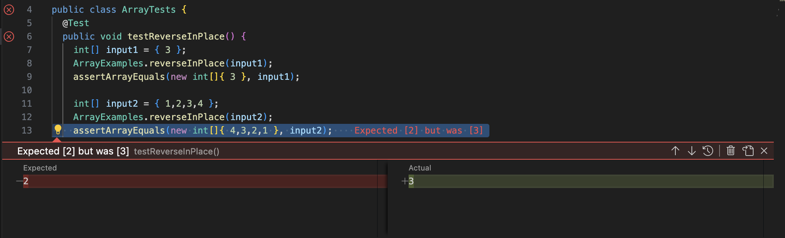

# Lab report 3 - Yifan Jiang


## Part 1 Bugs

One of the bug is the reverseInPlace method in the ArrayExamples file.

A failure inducing input: { 1,2,3,4 };
Below is the Junit test for this failing input: 

```
public class ArrayTests {
	@Test 
	public void testReverseInPlace() {
    int[] input2 = { 1,2,3,4 };
    ArrayExamples.reverseInPlace(input2);
    assertArrayEquals(new int[]{ 4,3,2,1 }, input2);
	}
```

An input that doesn't result in failure: {3}
Below is a Junit test for that input. 

```
public class ArrayTests {
	@Test 
	public void testReverseInPlace() {
    int[] input1 = { 3 };
    ArrayExamples.reverseInPlace(input1);
    assertArrayEquals(new int[]{ 3 }, input1);
	}
```

Junit test showing the symptom:


For the input2, the expected output is { 4,3,2,1 }, but got { 4,3,3,4 }.

This is the original code:
```
static void reverseInPlace(int[] arr) {
    for(int i = 0; i < arr.length; i += 1) {
      arr[i] = arr[arr.length - i - 1];
    }
  }
```

New code:
```
static void reverseInPlace(int[] arr) {
    for (int i = 0; i < arr.length / 2; i++) {
      int temp = arr[i];
      arr[i] = arr[arr.length - i - 1];
      arr[arr.length - i - 1] = temp;
    }
  }
```
The bug is that after the first half of the array got reversed, they have new data now. Their old values are not stored, so the second half of the array cannot get the correct value.
To fix this issue, we can make the for loop to only traverse through half of the list, and store the values of the first half to transfer to the new positions.
In this way, there won't be any overlapping data and the whole sequence would still be reversed. 

---

## Part2 - Researching Commands

I will work with the command `grep`

Example 1&2:
grep word file

```
Yifans-MBP:technical yifanjiang$ grep bomb 911report
grep: 911report: Is a directory
```
The output is an error showing that we cannot use `grep` on directories. 

```
Yifans-MBP:technical yifanjiang$ grep bomb 911report/chapter-1.txt
    The hijackers quickly gained control and sprayed Mace, pepper spray, or some other irritant in the first-class cabin, in order to force the passengers and flight attendants toward the rear of the plane. They claimed they had a bomb.
    Sweeney calmly reported on her line that the plane had been hijacked; a man in first class had his throat slashed; two flight attendants had been stabbed-one was seriously hurt and was on oxygen while the other's wounds seemed minor; a doctor had been requested; the flight attendants were unable to contact the cockpit; and there was a bomb in the cockpit. Sweeney told Woodward that she and Ong were trying to relay as much information as they could to people on the ground.
    The hijackers attacked sometime between 8:42 and 8:46. They used knives (as reported by two passengers and a flight attendant), Mace (reported by one passenger), and the threat of a bomb (reported by the same passenger). They stabbed members of the flight crew (reported by a flight attendant and one passenger). Both pilots had been killed (reported by one flight attendant). The eyewitness accounts came from calls made from the rear of the plane, from passengers originally seated further forward in the cabin, a sign that passengers and perhaps crew had been moved to the back of the aircraft. Given similarities to American 11 in hijacker seating and in eyewitness reports of tactics and weapons, as well as the contact between the presumed team leaders, Atta and Shehhi, we believe the tactics were similar on both flights.
    At 9:00, Lee Hanson received a second call from his son Peter: It's getting bad, Dad-A stewardess was stabbed-They seem to have knives and Mace-They said they have a bomb-It's getting very bad on the plane-Passengers are throwing up and getting sick-The plane is making jerky movements-I don't think the pilot is flying the plane-I think we are going down-I think they intend to go to Chicago or someplace and fly into a building-Don't worry, Dad- If it happens, it'll be very fast-My God, my God.
    American 77 pushed back from its gate at 8:09 and took off at 8:20. At 8:46, the flight reached its assigned cruising altitude of 35,000 feet. Cabin service would have begun. At 8:51, American 77 transmitted its last routine radio communication. The hijacking began between 8:51 and 8:54. As on American 11 and United 175, the hijackers used knives (reported by one passenger) and moved all the passengers (and possibly crew) to the rear of the aircraft (reported by one flight attendant and one passenger). Unlike the earlier flights, the Flight 77 hijackers were reported by a passenger to have box cutters. Finally, a passenger reported that an announcement had been made by the "pilot" that the plane had been hijacked. Neither of the firsthand accounts mentioned any stabbings or the threat or use of either a bomb or Mace, though both witnesses began the flight in the first-class cabin.
    At 9:32, a hijacker, probably Jarrah, made or attempted to make the following announcement to the passengers of Flight 93:"Ladies and Gentlemen: Here the captain, please sit down keep remaining sitting. We have a bomb on board. So, sit." The flight data recorder (also recovered) indicates that Jarrah then instructed the plane's autopilot to turn the aircraft around and head east.
    At 9:39, the FAA's Cleveland Air Route Traffic Control Center overheard a second announcement indicating that there was a bomb on board, that the plane was returning to the airport, and that they should remain seated.
    At least ten passengers and two crew members shared vital information with family, friends, colleagues, or others on the ground. All understood the plane had been hijacked. They said the hijackers wielded knives and claimed to have a bomb. The hijackers were wearing red bandanas, and they forced the passengers to the back of the aircraft.
    Passengers on three flights reported the hijackers' claim of having a bomb. The FBI told us they found no trace of explosives at the crash sites. One of the passengers who mentioned a bomb expressed his belief that it was not real. Lacking any evidence that the hijackers attempted to smuggle such illegal items past the security screening checkpoints, we believe the bombs were probably fake.
    The threat of Soviet bombers diminished significantly as the Cold War ended, and the number of NORAD alert sites was reduced from its Cold War high of 26. Some within the Pentagon argued in the 1990s that the alert sites should be eliminated entirely. In an effort to preserve their mission, members of the air defense community advocated the importance of air sovereignty against emerging "asymmetric threats" to the United States: drug smuggling, "non-state and state-sponsored terrorists," and the proliferation of weapons of mass destruction and ballistic missile technology.
    At 9:32, a third radio transmission came over the frequency:"Keep remaining sitting. We have a bomb on board." The controller understood, but chose to respond: "Calling Cleveland Center, you're unreadable. Say again, slowly." He notified his supervisor, who passed the notice up the chain of command. By 9:34, word of the hijacking had reached FAA headquarters.
    FAA headquarters had by this time established an open line of communication with the Command Center at Herndon and instructed it to poll all its centers about suspect aircraft. The Command Center executed the request and, a minute later, Cleveland Center reported that "United 93 may have a bomb on board." At 9:34, the Command Center relayed the information concerning United 93 to FAA headquarters. At approximately 9:36, Cleveland advised the Command Center that it was still tracking United 93 and specifically inquired whether someone had requested the military to launch fighter aircraft to intercept the aircraft. Cleveland even told the Command Center it was prepared to contact a nearby military base to make the request. The Command Center told Cleveland that FAA personnel well above them in the chain of command had to make the decision to seek military assistance and were working on the issue.
    Then, at 9:39, a fourth radio transmission was heard from United 93: Ziad Jarrah: Uh, this is the captain. Would like you all to remain seated. There is a bomb on board and are going back to the airport, and to have our demands [unintelligible]. Please remain quiet.
    The controller responded: "United 93, understand you have a bomb on board. Go ahead." The flight did not respond.
    The news of a reported bomb on board United 93 spread quickly at NEADS. The air defenders searched for United 93's primary radar return and tried to locate other fighters to scramble. NEADS called Washington Center to report: NEADS: I also want to give you a heads-up, Washington.
```
This command prints all the lines in the chapter-1.txt file in 911report that contain the word "bomb". 

This is very useful because we can quickly locate the desired sentence with any keywords in files. 

---

Example 3 & 4:
grep -l word *

```
Yifans-MBP:biomed yifanjiang$ grep -l GnRH *
1471-2121-2-21.txt
1471-213X-2-1.txt
```
This command displays all the files in the biomed directory that contains the word "GnRH"

```
Yifans-MBP:911report yifanjiang$ grep -l "New York" *
chapter-1.txt
chapter-10.txt
chapter-12.txt
chapter-13.1.txt
chapter-13.2.txt
chapter-13.3.txt
chapter-13.4.txt
chapter-13.5.txt
chapter-2.txt
chapter-3.txt
chapter-5.txt
chapter-6.txt
chapter-7.txt
chapter-8.txt
chapter-9.txt
preface.txt
```
This command displays all the files in the 911report directory that contains the word "New York". This showed that I can also search for exact matches using `" "`. 

This command is very useful because I can use it to find relevant files very quickly.

---

Examples 5 & 6:
grep -c word *

```
Yifans-MBP:911report yifanjiang$ grep -c "New York" *
chapter-1.txt:39
chapter-10.txt:1
chapter-11.txt:0
chapter-12.txt:3
chapter-13.1.txt:1
chapter-13.2.txt:29
chapter-13.3.txt:9
chapter-13.4.txt:6
chapter-13.5.txt:36
chapter-2.txt:1
chapter-3.txt:23
chapter-5.txt:2
chapter-6.txt:5
chapter-7.txt:11
chapter-8.txt:22
chapter-9.txt:23
preface.txt:1
```

```
Yifans-MBP:911report yifanjiang$ grep -c rocket *
chapter-1.txt:0
chapter-10.txt:0
chapter-11.txt:0
chapter-12.txt:0
chapter-13.1.txt:0
chapter-13.2.txt:0
chapter-13.3.txt:0
chapter-13.4.txt:0
chapter-13.5.txt:0
chapter-2.txt:0
chapter-3.txt:0
chapter-5.txt:0
chapter-6.txt:1
chapter-7.txt:0
chapter-8.txt:0
chapter-9.txt:0
preface.txt:0
```
This command can go through all the files in the current directory and check how many times did the key word appears in each file.
This is very useful because you can use this to screen for files that are the most or least relevant to the search.

--- 

Examples 7 & 8:
grep -n -C 2 word file

```
Yifans-MBP:911report yifanjiang$ grep -n -C 2 rocket chapter-6.txt
645-            
646-            Back in December 1999, Northern Alliance leader Ahmed Shah Massoud had offered to
647:                stage a rocket attack against Bin Ladin's Derunta training complex. Officers at the
648-                CIA had worried that giving him a green light might cross the line into violation of
649-                the assassination ban. Hence, Massoud was told not to take any such action without
```

```
Yifans-MBP:911report yifanjiang$ grep -n -C 2 40,700 chapter-1.txt
462-    FAA headquarters had by this time established an open line of communication with the Command Center at Herndon and instructed it to poll all its centers about suspect aircraft. The Command Center executed the request and, a minute later, Cleveland Center reported that "United 93 may have a bomb on board." At 9:34, the Command Center relayed the information concerning United 93 to FAA headquarters. At approximately 9:36, Cleveland advised the Command Center that it was still tracking United 93 and specifically inquired whether someone had requested the military to launch fighter aircraft to intercept the aircraft. Cleveland even told the Command Center it was prepared to contact a nearby military base to make the request. The Command Center told Cleveland that FAA personnel well above them in the chain of command had to make the decision to seek military assistance and were working on the issue.
463-
464:    Between 9:34 and 9:38, the Cleveland controller observed United 93 climbing to 40,700 feet and immediately moved several aircraft out its way. The controller continued to try to contact United 93, and asked whether the pilot could confirm that he had been hijacked.
465-
466-    There was no response.
```

This command can print out the line number in the file that contains the specific word. 
This comes in handy when you have to locate some sentences in a huge file. 

---

*Citations* 
https://phoenixnap.com/kb/grep-command-linux-unix-examples


