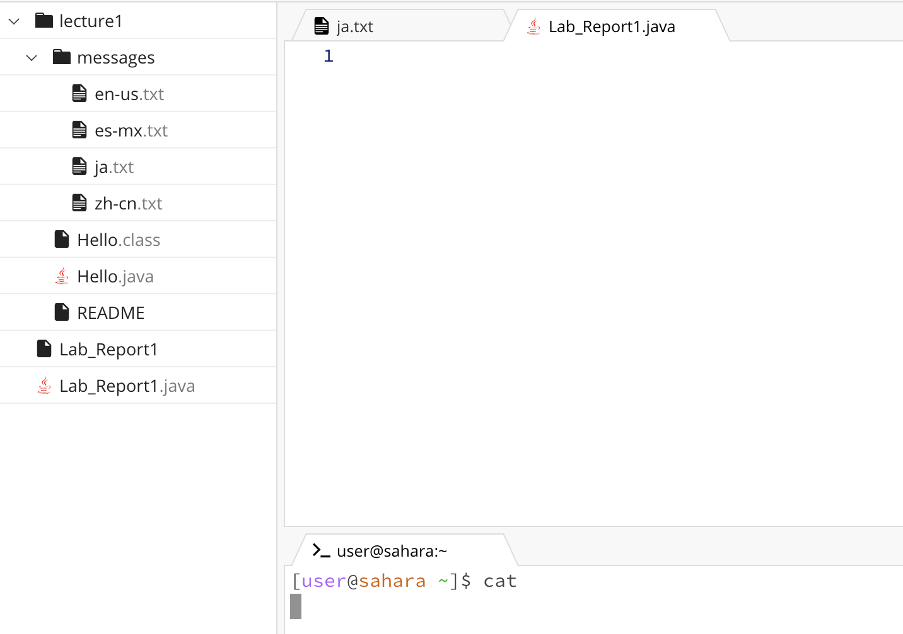

# Lab Report 1 - Yifan Jiang
---

**cd**

---

1. When this command was run, the working directory is home. 
2. I got this output because `cd` is used to change directory. When no argument is passed, it will change to the home directory. However, since I am already in the home directory, no output and change were made. 
4. The output is not an error. 

---

1. When this command was run, the working directory changed from home to lecture1.
2. I got this output because the `cd` command successfully changed my working directory from home to 1ecture1.
3. The output is not an error.

---

1. When this command was run, the working directory is unchanged and still being messages.
2. I got this output because `cd` can only be used for directories, not files. Thus, no change was made.
3. The output is an error because we are not using the correct syntax for `cd`.

---

**ls**

---

1. When this command was run, the working directory is lecture1.
2. I got this output because `ls` will show me the names of files and folders inside the current working directory.
3. The output is not an error.

---

1. When this command was run, the working directory is lecture1.
2. I got this output because `ls` will show me the names of files and folders inside the argument directory.
3. The output is not an error.

---

1. When this command was run, the working directory is messages.
2. I got this output because `ls` will show me the name of the argument file.
3. The output is not an error.

---

**cat**

---

1. When this command was run, the working directory is home.
2. I got the blank output because `cat` should have arguments so that the concatenation can happen.
3. The output is not an error.

---

1. When this command was run, the working directory is lecture1.
2. I got this output because `cat` is used to print the content of files, not directories.
3. The output is an error, as it tells me that the argument is not the right form because `cat` doesn't work with directories. 

---

1. When this command was run, the working directory is messages.
2. I got this output because the `cat` code prints out the contents of the two files.
3. The output is not an error.

