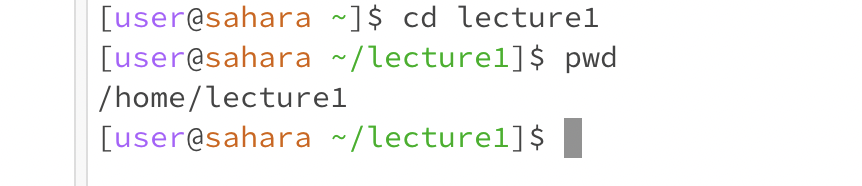

# Lab Report 1 - Yifan Jiang
---

1. When this command was run, the working directory is home. 
2. I got this output because cd is used to change directory, but I didn't provide an argument to make the change. Thus, there was no output and no change was made. 
3. The output is not an error. 

---

1. When this command was run, the working directory is now changed to lecture1.
2. I got this output because the cd command successfully changed my working directory from home to 1ecture1.
3. The output is not an error.

---

