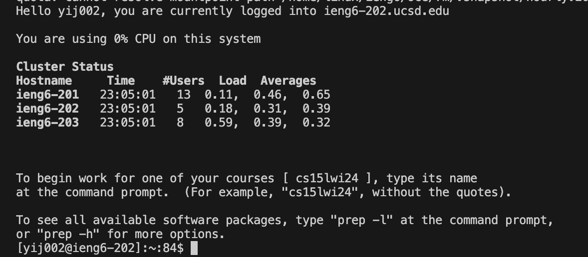

# Lab Report 4

---

*Step 4*

For this step, I just typed ssh username@ieng6.ucsd.edu and pressed `enter`. 

---

*Step 5*

For this step, I copied the SSH url using `command c`, typed git clone, and used `command v` to paste the url, then pressed `enter`.

---

*Step 6*

For this step, I first typed `ls` to check the directory. Then, use  `cd` to change into the lab7 directory. Then, I typed `bash test.sh` to run the tests.

---

*Step 7*

For this step, I typed `vim` ListExamples.java to enter the editing mode. Then I pressed `i` to enter editing mode. Then, I pressed `up`,`up`,`up`,`up`,`up`, `right`,`right`,`right`,`right`,`right`,`right`
,`right`,`right`,`right`,`right`,`right`, `2`, `right`, `delete` to make the edit. Then `esc` to leave the exit mode. Then, `:wq`,`enter`to save the change and exit vim. 

---

*Step 8*

For this step, I pressed `up`,`up`,`up` for the code "bash test.sh" to run the test. 

---

*Step 9*

For this step, I typed "git commit -am "All good"" to commit the change, and "git push" to push it to github. 

