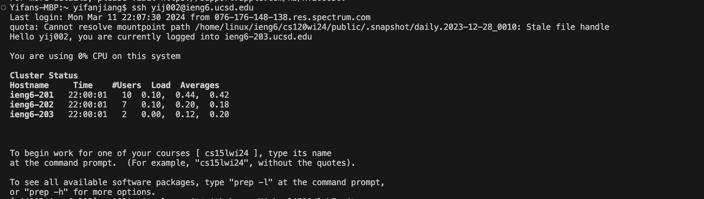
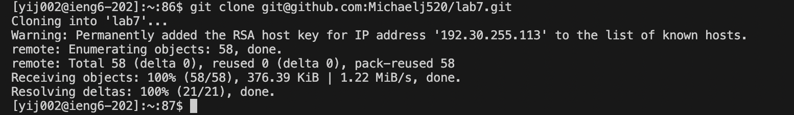
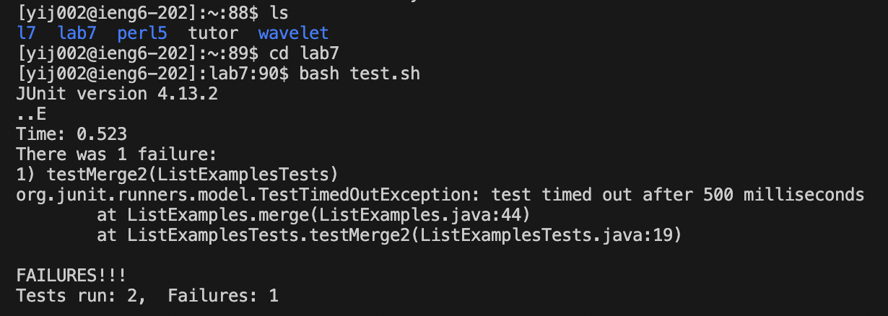
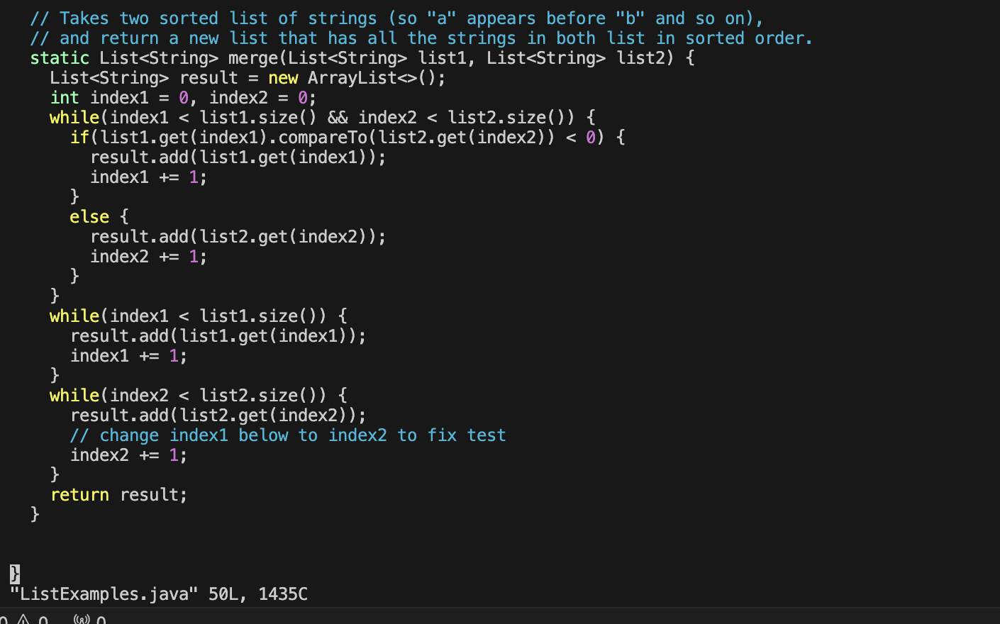
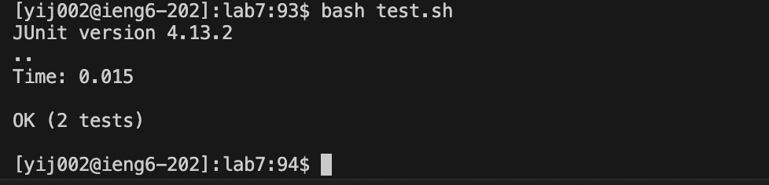
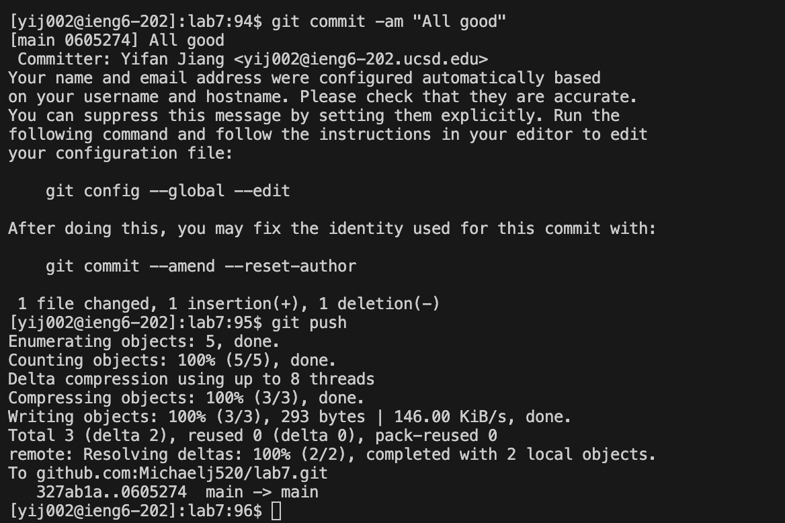

# Lab Report 4

---

*Step 4*

For this step, I typed  `ssh<space>yij002@ieng6.ucsd.edu <enter>`.

This ssh step allows me to log into the ucsd server to further procedd with working on the code. Since I have already set up the account to login without password, I don't need to type in the passwords anymore. 

---

*Step 5*

For this step, I typed `git clone <Ctrl-c> (git@github.com:Michaelj520/lab7.git) <enter>`

The `<Ctrl-c>` command copied a url link (git@github.com:Michaelj520/lab7.git), which is the ssh key from my own github fork for the lab7 code. The command `git clone` allows me to clone the code from github to the local terminal, so that I can directly access the code from my terminal. 

---

*Step 6*

For this step, I first typed `ls <enter>` to check the directory to see the files or directories inside. 
Then, I typed `cd<space>lab7 <enter>` to change my current directory into the lab7 directory. Then, I typed `bash<space>test.sh <enter>` to run the Junit tests. The command `bash` will allow bash codes to run, and the file tesh.sh contains excution of Junit tests for the file ListExamples.java. 

---

*Step 7*

For this step, I typed `vim<space>ListExamples.java <enter>` to edit the code using the Vim text editor. Then I pressed `i` to enter editing mode. Then, I pressed `up`,`up`,`up`,`up`,`up`, `right`,`right`,`right`,`right`,`right`,`right`,
`right`,`right`,`right`,`right`,`right`, `2`, `right`, `delete` to make the edit. This changes the index at line 44 from 1 to 2. 
Then I pressed `esc` to leave the exit mode. Then, I pressed `:wq <enter>` to save the change and exit vim. 

---

*Step 8*

For this step, I pressed `up`,`up`,`up` for the code "bash test.sh" and pressed `<enter>` to run the tests. 

---

*Step 9*

For this step, I typed `git commit -am All good <enter>` to commit the change in code, and typed `git push <enter>` to push it to github. 

