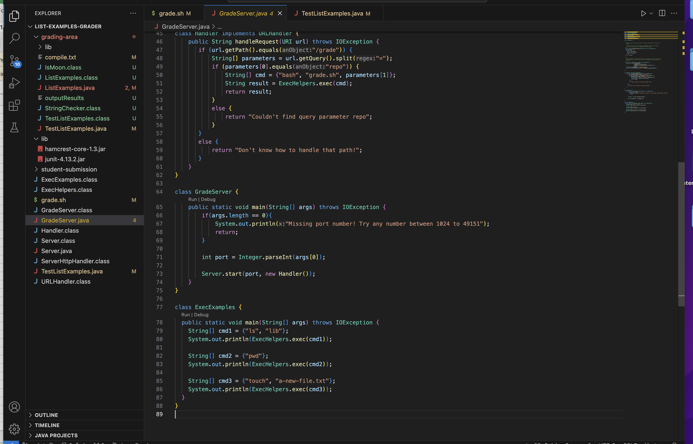
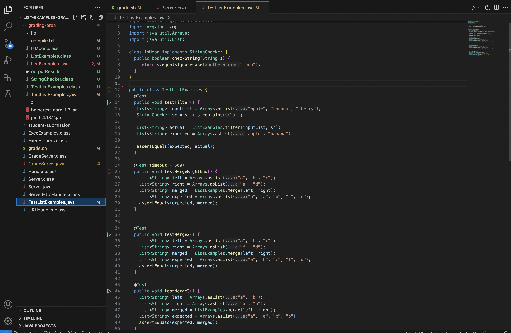

# Lab report 5 - Yifan Jiang

## Part 1 Debugging Scenario

*Step 1* Edstem post

Hi, I am experiencing an issue with my code for the List-examples-grader. I am trying to finish my bash codes for grade.sh to provide a percentage score for all the
input submissions. However, my code produces a score of 100% even when the input code failed on different tests. For example, when I passed in the starter code from lab3, my grade.sh 
produces a score of 100% when some of the tests didn't pass. What happened? How to fix my code?

---

*Step 2* TA response

Hi, thank you for reaching out and providing your codes and terminal. 

It seems like there is something wrong with the bash code in your grade.sh. Let's take a closer look at your code for grade.sh. 
On line 34, you assigned `SUCCESS` as a variable that stores the number of "OK" in the outputResults, which stores the output of your Junit tests.
There is a bug on line 36. In the `if` statement, you wrote `if [[ -n SUCCESS ]]`. There is supposed to check whether the variable `SUCCESS` is empty or not. 
However, you missed a dollar sign `$` before the `SUCCESS` variable. If you don't have this dollar sign, the code will check whether the string "SUCCESS" itself is empty or not, which is always true.
Thus, you will get the result of 100% all the time because this `if` statement is always true.
In order to check for the vraiable `SUCCESS`, try adding a dollar sign like this `if [[ -n $SUCCESS ]]`.

I hope this helps and will solve your problem! Have a great day!

---

*Step 3* Student feedback

Thank you so much for your help! The bug is fixed! My code now correctly calculates the score for each input. 

The bug is exactly that I didn't had the `$` sign before the "SUCCESS" variable. Without it, the if statement is checking whether the string "SUCCESS" itself is empty or not, rather than checking the variable. 
After the `$` sign is added, the bash script will check whether all Junit tests have passed or not, and return a score of 100% when all the tests are passed because of the string "OK"
being present in the file `outputResults`. 

---

*Step 4* Supporting Information 

*File & Directory Structure*

This file and directory structure is from the code in class. I made some edits in grade.sh. 

*Contents of each file before fixing the bug*

*Command line ran to trigger the bug*

`bash grade.sh`

*Description of edition*

In the file grade.sh, on line 36, add `$` sign before the "SUCCESS" variable inside the if statement. 
This fix makes the if statement looks for whether the variable SUCCESS is empty or not, which fulfills the logic of the code. 

---

## Part 2 Reflection 

I have learned many useful and valuable things from the lab experience during the second half of the quarter. I learned how to use bash, which is probably like the third programming language I know.
I also learned how to use the terminal/command line completely by itself. In the past, I always need to rely on apps like VisualStudio code, but now I can really handle files and do things via
the terminal alone. Also, I learned how to interact with git files, and use commands like git add and git push. I have learned a lot from the amazing tutors like Yasushi. I believe that 
CSE15L really made me more confident as a programmer. 

